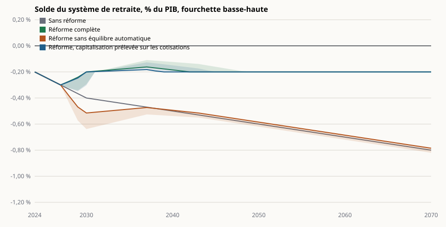

# Projection du solde du système de retraite, 2024-2070

Modèle et tests : dépôt convergence-deliberation, `packages/projection-retraites`.

Ordre de grandeur, pas une microsimulation : agrégats et sensibilités publiés, hypothèses listées en bas, fourchette basse et haute pour chaque scénario. Soldes en % du PIB et en milliards d'euros de 2024. La réforme s'applique à partir de 2028.

## Solde en % du PIB

| Scénario                                             | 2030              | 2040              | 2050              | 2070              |
| ---------------------------------------------------- | ----------------- | ----------------- | ----------------- | ----------------- |
| Sans réforme                                         | -0,40 % à -0,40 % | -0,50 % à -0,50 % | -0,60 % à -0,60 % | -0,80 % à -0,80 % |
| Réforme complète                                     | -0,29 % à -0,20 % | -0,12 % à -0,18 % | -0,20 % à -0,20 % | -0,20 % à -0,20 % |
| Réforme sans équilibre automatique                   | -0,64 % à -0,52 % | -0,54 % à -0,49 % | -0,62 % à -0,59 % | -0,82 % à -0,79 % |
| Réforme, capitalisation prélevée sur les cotisations | -0,30 % à -0,20 % | -0,15 % à -0,20 % | -0,20 % à -0,20 % | -0,20 % à -0,20 % |

## Solde en milliards d'euros de 2024

| Scénario                                             | 2030              | 2040              | 2050              | 2070              |
| ---------------------------------------------------- | ----------------- | ----------------- | ----------------- | ----------------- |
| Sans réforme                                         | -12 Md€ à -12 Md€ | -17 Md€ à -17 Md€ | -23 Md€ à -23 Md€ | -37 Md€ à -37 Md€ |
| Réforme complète                                     | -9 Md€ à -6 Md€   | -4 Md€ à -6 Md€   | -8 Md€ à -8 Md€   | -9 Md€ à -9 Md€   |
| Réforme sans équilibre automatique                   | -20 Md€ à -16 Md€ | -19 Md€ à -17 Md€ | -24 Md€ à -22 Md€ | -38 Md€ à -36 Md€ |
| Réforme, capitalisation prélevée sur les cotisations | -9 Md€ à -6 Md€   | -5 Md€ à -7 Md€   | -8 Md€ à -8 Md€   | -9 Md€ à -9 Md€   |

## Ce que les retraités absorbent : sous-indexation cumulée

| Scénario                                             | 2030            | 2040            | 2050            | 2070            |
| ---------------------------------------------------- | --------------- | --------------- | --------------- | --------------- |
| Sans réforme                                         | 0,00 % à 0,00 % | 0,00 % à 0,00 % | 0,00 % à 0,00 % | 0,00 % à 0,00 % |
| Réforme complète                                     | 2,97 % à 2,75 % | 3,65 % à 2,75 % | 3,79 % à 3,51 % | 5,73 % à 5,45 % |
| Réforme sans équilibre automatique                   | 0,00 % à 0,00 % | 0,00 % à 0,00 % | 0,00 % à 0,00 % | 0,00 % à 0,00 % |
| Réforme, capitalisation prélevée sur les cotisations | 2,97 % à 2,83 % | 3,75 % à 2,95 % | 4,39 % à 4,10 % | 6,84 % à 6,57 % |

## Hypothèses

| Hypothèse                                   | Valeur                                                             | Source                                                                                      | Statut   |
| ------------------------------------------- | ------------------------------------------------------------------ | ------------------------------------------------------------------------------------------- | -------- |
| cadrage.pibDepart                           | 2935.2                                                             | Insee, comptes nationaux, PIB 2024 en Md€ courants (moteur des faits)                       | moteur   |
| cadrage.croissanceReelle                    | 0.01                                                               | COR 2025, scénario central : productivité du travail +1 % par an                            | memoire  |
| cadrage.inflation                           | 0.0175                                                             | COR 2025 : hypothèse d’inflation de long terme                                              | memoire  |
| cadrage.depensesPib                         | {"2024":0.134,"2030":0.133,"2040":0.131,"2050":0.128,"2070":0.125} | COR 2025, scénario central, dépenses de retraite en % du PIB                                | memoire  |
| cadrage.ressourcesPib                       | {"2024":0.132,"2030":0.129,"2040":0.126,"2050":0.122,"2070":0.117} | COR 2025, convention EPR (effort de l’État constant en part de PIB), ressources en % du PIB | memoire  |
| departA63.coutBrutPleinPib                  | 0.003                                                              | Réforme 2023 : +17,7 Md€ en 2030 pour deux ans ; une année ≈ 9 Md€ ≈ 0,3 % du PIB           | memoire  |
| departA63.partQuiPartA63                    | {"basse":0.3,"haute":0.6}                                          | Hypothèse : part des éligibles acceptant 10 % de décote à vie                               | memoire  |
| departA63.recuperationParDecote             | 0.5                                                                | Hypothèse : moitié du coût récupérée par la décote sur la durée de retraite, en 15 ans      | memoire  |
| departA63.monteeAns                         | 3                                                                  | Montée en charge sur trois générations de départ                                            | memoire  |
| tauxPleinA65.coutPib                        | {"basse":0.0007,"haute":0.0013}                                    | DREES : coût d’un taux plein sans condition à 65 ans, 2 à 4 Md€ par an                      | memoire  |
| tauxPleinA65.monteeAns                      | 2                                                                  | Deux générations concernées à la fois                                                       | memoire  |
| emploiSeniors.gainPib                       | {"basse":0.0013,"haute":0.002}                                     | +5 points de taux d’emploi des 55-64 ans : 4 à 6 Md€ de cotisations et moindres pensions    | memoire  |
| emploiSeniors.monteeAns                     | 10                                                                 | Rattrapage sur dix ans, rythme observé en Allemagne 2005-2015                               | memoire  |
| equilibreAutomatique.seuilDeficitPib        | 0.002                                                              | Le mécanisme ne s’active qu’au-delà de 0,2 % du PIB de déficit                              | document |
| equilibreAutomatique.sousIndexationMaxParAn | 0.01                                                               | Au plus un point d’indexation retenu par an                                                 | document |
| equilibreAutomatique.partPensionsExemptees  | 0.15                                                               | Pensions sous le minimum contributif exemptées : environ 15 % de la masse                   | memoire  |
| capitalisation.tauxCotisation               | 0.02                                                               | Deux points de salaire au-dessus du plafond, pour les entrants                              | document |
| capitalisation.partSalairesAuDessusPlafond  | 0.12                                                               | Part de la masse salariale au-dessus du plafond de la Sécurité sociale                      | memoire  |
| capitalisation.masseSalarialePib            | 0.5                                                                | Masse salariale brute rapportée au PIB                                                      | memoire  |
| capitalisation.dureeGeneration              | 42                                                                 | Années pour que tous les cotisants soient des entrants post-réforme                         | document |

« moteur » : lu dans le moteur des faits. « document » : choix de la proposition. « mémoire » : ordre de grandeur à confronter à la source citée avant publication.
